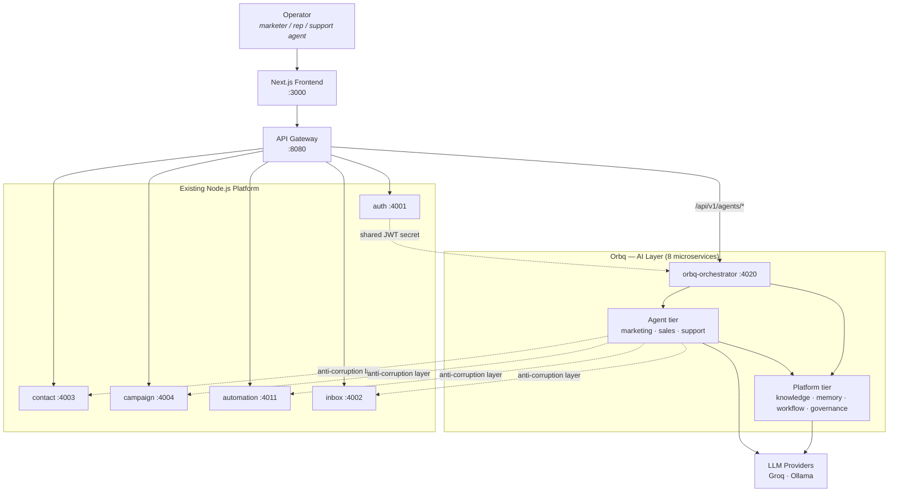
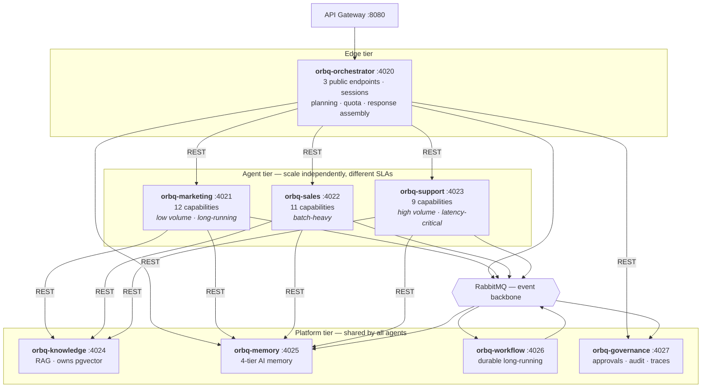
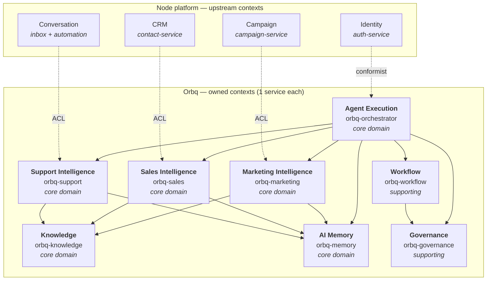
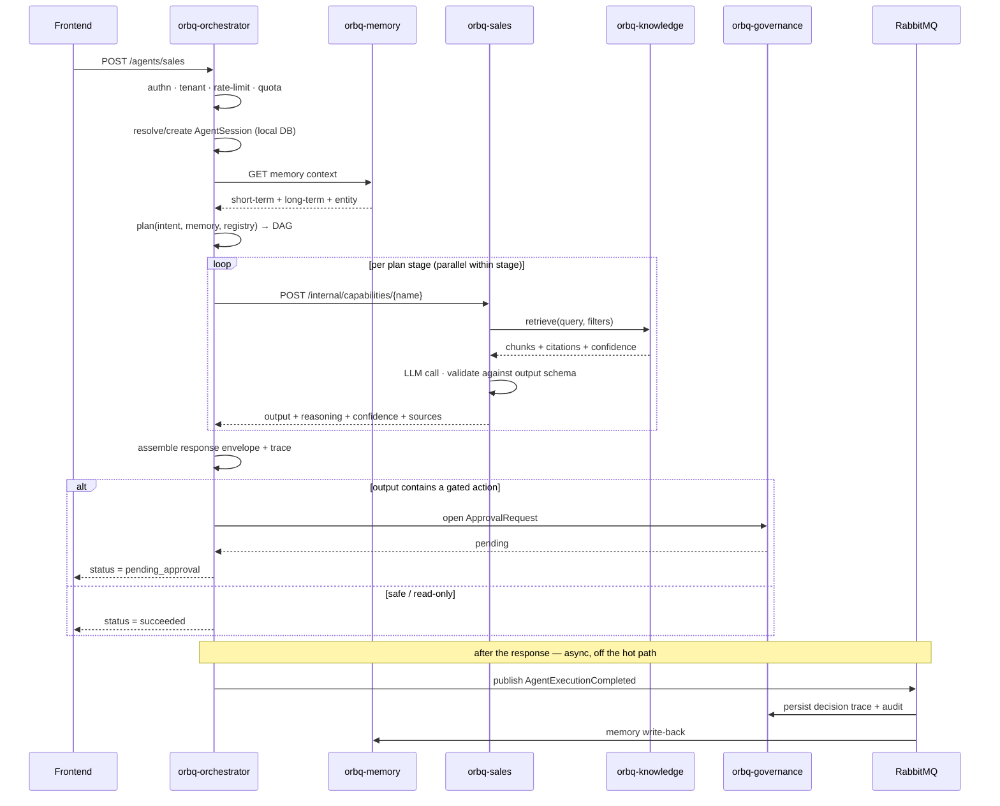
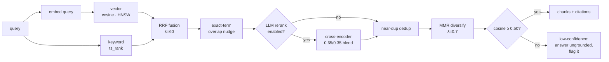
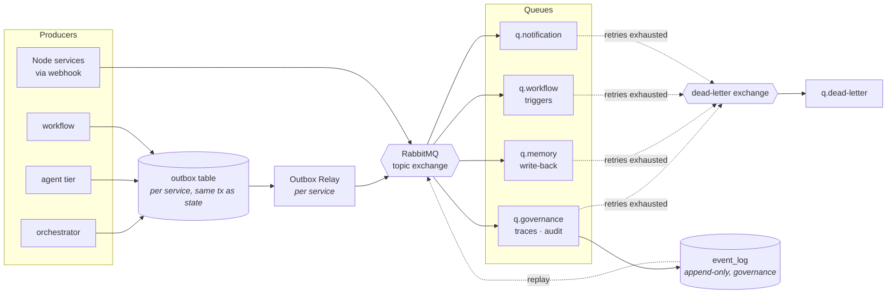
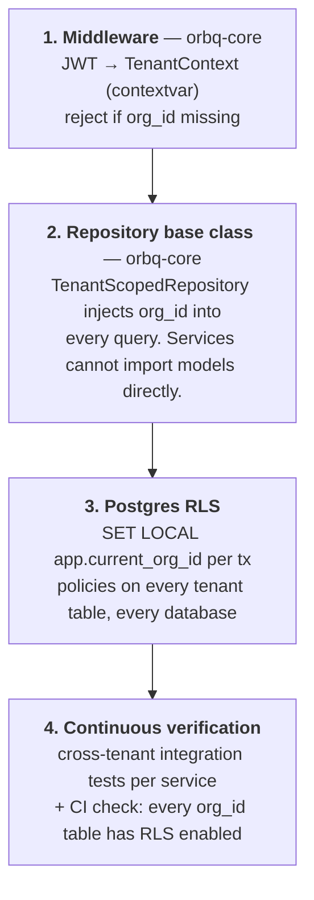
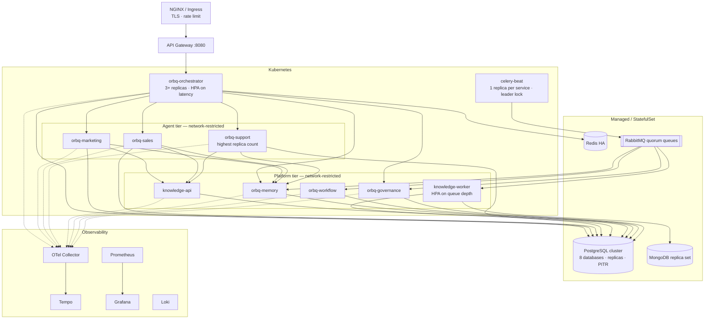
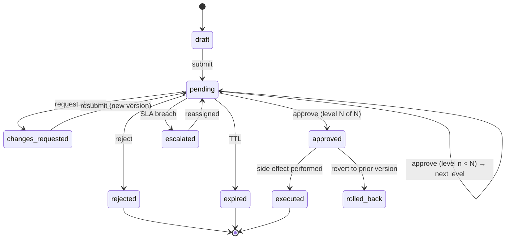
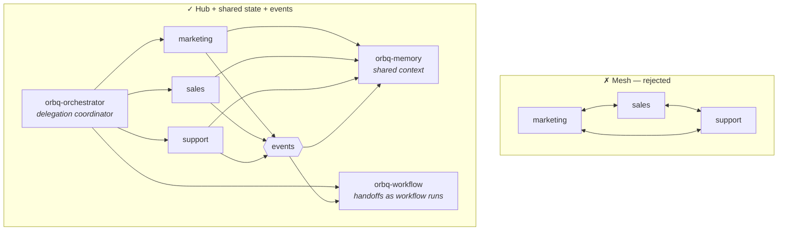

# Orbq — Enterprise System Architecture

**Phase 1 deliverable · Architecture only, no implementation code**

| Field | Value |
|---|---|
| Document | Orbq Backend — Enterprise System Architecture |
| Version | **2.0 — microservices** |
| Status | Draft for review |
| Date | 2026-08-04 |
| Supersedes | v1.0 (modular monolith); `ai-agent-backend/` (discarded except the RAG engine — §11) |
| Audience | Backend engineers, platform/infra, security review |

> **Change from v1.0.** v1.0 proposed a modular monolith. That is reversed. Orbq is
> **microservices**. The reasoning is in ADR-002 (§5), including an honest account of why
> the original argument against microservices was weak for this specific workload.

---

## 1. Executive summary

Orbq is the **AI layer** of the Lead Automation platform: **eight microservices** in three
tiers, deployed independently, communicating over REST for synchronous calls and RabbitMQ
for asynchronous events.

It exposes exactly **three public endpoints** to the frontend — Marketing, Sales, Support —
and hides roughly thirty internal AI capabilities behind an orchestrator. The service
topology is invisible to the frontend by design: we can split or merge services without a
frontend change.

Orbq does **not** own the business record. Contacts, companies, campaigns, conversations,
messages, users, billing, and channel integrations remain owned by the existing thirteen
Node.js microservices. Orbq reads and writes them through an anti-corruption layer, and
owns only genuinely AI-native state: knowledge and embeddings, agent sessions, execution
history, AI memory, explainability traces, approvals, and workflow runs.

### The four services

| Service | Role | Owns | Port |
|---|---|---|---|
| **`orbq-ai-agents`** | Platform core — **the brain** | Orchestrator, sessions, executions, RAG/knowledge, AI memory, workflow engine, approvals/governance, analytics, events, WebSocket gateway | 4020 |
| **`orbq-marketing`** | Marketing Agent | Campaign plans, SEO/AEO briefs, personas, competitor intelligence, CTWA, content artifacts | 4021 |
| **`orbq-sales`** | Sales Agent | Lead scores, buying intent, forecasts, pipeline, follow-ups, handoffs | 4022 |
| **`orbq-support`** | Support Agent | Ticket classification, suggested replies, CSAT risk, SLA, escalations | 4023 |

Ports 4020–4023 sit above the existing platform's 4001–4013, so nothing collides.

**Every feature from all 23 phases lives inside these four services** — as a module, not a
new deployable. Knowledge, memory, workflow, approvals, collaboration, intelligence, and
analytics are packages inside `orbq-ai-agents`; the capabilities are packages inside the
three agent services. See ADR-002 (§5) for why this is the right granularity, and §4.3 for
where each phase's features land.

### Three properties drive every decision

1. **A narrow public contract.** Three endpoints, enforced by a contract test. Internal
   service count can change freely; the frontend never notices.
2. **Tenant isolation is structural, not incidental.** Every row carries `org_id`, enforced
   at four independent layers *in every service* — and in microservices this is harder, not
   easier, because there are now eight places to get it wrong (§17).
3. **Every AI decision is explainable and reversible.** Reasoning, confidence, and retrieved
   sources persist for every execution; anything customer-facing passes an approval gate.

### What changed from the previous backend

| | `ai-agent-backend` (discarded) | Orbq (this design) |
|---|---|---|
| API surface | ~12 routers, one per capability | 3 agent endpoints |
| Structure | 1 service, routers calling prompt modules | 8 services, bounded-context aligned |
| Agents | 13 prompt modules called directly by routers | Capability registry behind an orchestrator |
| Async work | None — inline in the request | Celery + RabbitMQ per service |
| Memory | None | Four-tier AI memory service (§14) |
| Explainability | Provider log only | Full decision trace per execution (§15) |
| Approvals | None | State machine gating all outbound actions (§12.3) |
| RAG | **Kept as-is** | **Kept, promoted to its own service** (§11) |

---

## 2. Scope and boundaries

### ADR-001 — Orbq is the AI layer, not a platform rewrite

**Status:** Accepted · **Date:** 2026-08-04

**Context.** The platform already runs thirteen Node.js microservices behind an API
gateway. A greenfield backend that also absorbed auth, CRM, campaigns, and billing would be
a multi-quarter rewrite with no user-visible benefit for most of that time, and would
require dual-writing every core entity during migration.

**Decision.** Orbq replaces `ai-agent-backend` only. It owns AI-specific state and behavior.
All other domains stay in the Node stack and are consumed over HTTP.

**Consequences.**
- (+) Orbq ships incrementally; a failure's blast radius is the AI features only.
- (+) The API gateway already routes `AI_SERVICE_URL → ai-agent-service:4005`. Orbq slots
  into that seam — one gateway config change, pointing at `orbq-orchestrator:4020`.
- (−) Orbq depends on Node services for context. Mitigated by the resilience policy in §7.4.
- (−) No foreign keys to `contacts`/`campaigns`. Cross-boundary references are *unenforced*
  UUIDs with a reconciliation job — the standard cost of a distributed boundary, accepted
  deliberately (§16.4).

### 2.1 Ownership map

| Domain | Owner | Orbq's access |
|---|---|---|
| Organizations, Users, Roles, Permissions | `auth-service` (4001) | JWT claims; read-only API for team lookup |
| Contacts, Leads, Companies | `contact-service` (4003) | Read + write via ACL |
| Campaigns, Broadcasts | `campaign-service` (4004) | Read + write via ACL |
| Conversations, Messages | `inbox-service` (4002), `automation-service` (4011) | Read via ACL; sends go through automation |
| Channel integrations (WhatsApp, IG, LinkedIn, Email, SMS) | `automation-service`, `linkedin-service` (4009), `integration-service` (4008) | Never called directly — always via automation-service |
| Payments, Subscriptions | existing schema + billing | Read-only, for quota enforcement |
| Platform analytics | `analytics-service` | Orbq emits events; analytics aggregates |
| **Knowledge, documents, embeddings** | **`orbq-knowledge`** | Owned |
| **Agent sessions, execution history** | **`orbq-orchestrator`** | Owned |
| **AI memory** | **`orbq-memory`** | Owned |
| **Explainability, approvals, audit** | **`orbq-governance`** | Owned |
| **Workflow runs** | **`orbq-workflow`** | Owned |
| **AI insights (scores, forecasts, classifications)** | **agent services** | Owned |

**Rule of thumb:** if deleting the row would only affect AI behavior, Orbq owns it. If it
would affect a customer's business record, Node owns it.

---

## 3. System context (C4 level 1)



**Critical constraint:** the frontend reaches Orbq only through
`POST /api/v1/agents/{marketing|sales|support}`. There is no `/seo`, no `/lead-score`, no
`/rag/query` in production. Enforced by a test, not a convention (§9.3).

---

## 4. Service decomposition

### 4.1 The topology



### 4.2 Where every phase's features live

All 23 phases map onto four deployables. Nothing gets its own service.

| Inside `orbq-ai-agents` | Phase |
|---|---|
| `orchestration/` — planner, router, executor, session + execution records | 5 |
| `rag/` — loaders, chunking, embedder, retriever, reranker, citations, versioning | 6 |
| `workflows/` — engine, steps, conditions, compensation, handoff sagas | 10 |
| `workers/` — Celery queues: ingestion, agent, workflow, events | 11 |
| `realtime/` — WebSocket gateway, Redis pub/sub fanout | 12 |
| `memory/` — short-term, long-term, semantic, entity, consolidation | 13 |
| `governance/` — approvals, audit, explainability, decision traces | 13, 19 |
| `events/` — bus, outbox, consumers, DLQ, replay | 11 |
| `analytics/` — CQRS read-models, dashboards, forecasts, reports | 15, 23 |
| `collaboration/` — delegation, shared context, handoff coordination | 20 |
| `integrations/` — anti-corruption layer to the Node platform | 14 |

| Inside the agent services | Phase |
|---|---|
| `orbq-marketing/capabilities/` — campaign planner, SEO, AEO, persona, competitor intel, content, CTWA, brand tone, sentiment, calendar | 7, 21, 22 |
| `orbq-sales/capabilities/` — lead scoring, buying intent, CRM analysis, opportunity score, forecast, cold revival, meeting prep, pipeline, handoff | 8 |
| `orbq-support/capabilities/` — ticket classification, suggested reply, CSAT risk, escalation, SLA, conversation summary, customer timeline | 9 |

### 4.3 Why these three cuts, and not others

Each split needs a reason that is not "microservices are good". Here is the reason for
each boundary:

| Boundary | Why it is separate |
|---|---|
| **`orbq-ai-agents` vs. the agent tier** | It owns the public contract and session lifecycle, so the 3-endpoint rule lives in exactly one codebase and agent services can never accidentally expose themselves. It is also the only service the gateway needs to know about. |
| **marketing / sales / support, from each other** | **Genuinely different scaling signals and SLAs.** Support is high-volume and latency-critical (a customer is waiting). Sales is batch-heavy (nightly rescoring across 100k leads). Marketing is low-volume and long-running (competitor research, content generation — 30s+ runs). Scaling these together means over-provisioning for the union of three unrelated load shapes. This is the textbook justification for a service boundary, and the only one in this design that survives scrutiny at the agent level. |

**Why knowledge, memory, workflow, governance, and analytics are modules, not services.**
An earlier draft of this document split them out. That was over-decomposition, and the
reasoning was weak in the same way ADR-002 v1.0's latency argument was weak — it applied a
general principle without checking whether the specific conditions held:

- They **all scale on the same signal** (agent traffic). Independent scaling is the primary
  reason to pay for a service boundary, and it does not apply.
- They are **called on nearly every agent execution**. Orchestrator → memory → knowledge →
  governance is one logical operation; splitting it introduces four failure modes and four
  sagas to protect a transaction that Postgres would have given us for free.
- They share the **same tenant context and the same database**. Cross-module consistency is
  a local transaction; cross-service consistency is an event, an outbox, and a reconciliation
  job.
- Ingestion isolation — the one real argument for splitting knowledge — is achieved with a
  **separate Celery queue and worker deployment**, not a separate service. A 500-page PDF
  ingest runs on `orbq-ai-agents-worker-ingestion` pods and cannot touch API latency.

Module boundaries inside `orbq-ai-agents` are enforced by import-linter contracts, so
`analytics/` cannot reach into `governance/`'s models. If one of them later develops a
genuinely different scaling curve, it extracts cleanly — the internal interfaces are already
explicit.

### 4.4 What is deliberately NOT a service

**One service per capability (~30 services).** Rejected without qualification. SEO, AEO, and
Persona are prompt templates plus an output schema. They share the same tenant context,
scale on the same signal, and are always invoked as part of a larger plan. Thirty services
would mean thirty deploy pipelines, thirty dashboards, and thirty on-call surfaces for what
amounts to thirty files. The capability registry inside each agent service gives the same
modularity at none of the cost.

**A separate notification service.** The Node platform already has one (`:4012`). Orbq calls
it through the ACL. Building a second would be duplication.

**A campaign execution engine.** The Node platform already has a working one — BullMQ queue,
retry/backoff worker, per-recipient delivery tracking, rate limiting
([bulkCampaignWorker.js](services/campaign-service/src/services/bulkCampaignWorker.js),
[campaignSendController.js](services/automation-service/src/controllers/campaignSendController.js)).
Orbq generates campaign *plans and content*; Node *executes* them. See §25.3 — this is the
one place the phase list conflicts with ADR-001.

**Direct agent-to-agent calls.** Marketing, Sales, and Support never call each other.
Collaboration routes through the orchestrator and shared state. See §25.2 — this is the
single most important constraint in the collaboration design.

---

## 5. Microservices decision

### ADR-002 — Microservices, split by bounded context and workspace

**Status:** Accepted · **Date:** 2026-08-04 · **Supersedes:** ADR-002 v1.0 (modular monolith)

**Context.** v1.0 of this document argued for a modular monolith. The central argument was
latency: a Sales run invokes lead scoring → CRM analysis → retrieval → memory, which as
services becomes four network hops per user action.

**Why that argument was wrong here.** An agent execution spends 4–8 seconds inside LLM
inference. Six internal hops at ~5ms each is roughly 30ms — **under 1% of the request's time
budget.** The latency objection to microservices is decisive in a CRUD system where the
service's own work is measured in milliseconds. In an LLM system, inference dominates so
completely that inter-service latency is close to free. The v1.0 analysis imported an
instinct from a different workload.

**What actually argues for microservices here:**

1. **The three agents have genuinely divergent load shapes.** Support: thousands of
   low-latency requests. Sales: nightly batch across the whole lead database. Marketing:
   dozens of expensive, minutes-long runs. One deployable means the autoscaler gets one
   signal for three unrelated demands, and the slowest workload sets the resource floor.
2. **Ingestion isolation is a real availability concern.** Document ingestion is CPU-heavy
   and bursty. In one process it competes with interactive inference for the same pool.
3. **Blast radius.** A memory leak in competitor research should not take down customer
   support replies. In a monolith it does.
4. **Consistency with the platform.** The existing thirteen Node services are already
   microservices. Deployment tooling, service discovery, gateway routing, and the on-call
   model all exist. Orbq gets to reuse them rather than introduce a second paradigm.
5. **Compliance isolation.** Audit and approvals in a separate service with restricted
   database grants is a materially stronger control than a module in the same process.

**Decision.** **Four services**: one platform core (`orbq-ai-agents`) plus one per agent
workspace. REST for synchronous calls, RabbitMQ events for async. Database per service.

**On granularity.** An intermediate draft of this ADR proposed ten services, splitting
knowledge, memory, workflow, governance, intelligence, and analytics into their own
deployables. That was wrong, for a reason worth recording: *a bounded context is a modeling
boundary; it is not automatically a deployment boundary.* Those six contexts are real and
their module boundaries are worth enforcing — but they scale on the same signal, participate
in the same transactions, and are invoked on nearly every request. Splitting them bought
distributed-systems cost with no scaling or isolation return (§4.3).

The three agent boundaries survive that test; the platform ones do not. Four is where the
justification actually stops.

**Consequences — the costs we are accepting, and how each is paid:**

| Cost | Mitigation |
|---|---|
| No distributed transactions | The hot path is designed to avoid them entirely — the orchestrator writes locally and fans out via events (§10.3). Sagas are used only in `orbq-workflow`, where they are the natural model anyway. |
| Eight deploy pipelines, eight on-call surfaces | A shared service template and a shared `orbq-contracts` package. One CI workflow, parameterized. |
| Debugging spans services | OpenTelemetry tracing is not optional — it is a Phase 3 deliverable, not a Phase 17 nice-to-have (§21). |
| Local dev needs eight processes | Docker Compose profiles: `core` (orchestrator + one agent + knowledge) for most work, `full` for integration. |
| Tenant isolation must be right in eight places | Enforced in the shared `orbq-core` package, not per-service. A CI check fails any service whose tenant tables lack RLS (§17.2). |
| Schema changes can span services | Contract versioning + expand/migrate/contract. No service reads another's tables — ever (§16.2). |

**Revisit trigger.** If the agent tier's three services show identical scaling curves after
six months of production data, merging them back is the correct move. Boundaries should
follow observed load, not predictions.

### ADR-003 — REST/JSON internally, not gRPC

**Status:** Accepted · **Date:** 2026-08-04

**Context.** Enterprise microservices commonly use gRPC internally for typed contracts and
binary speed.

**Decision.** REST/JSON with a shared `orbq-contracts` Pydantic package.

**Rationale.** gRPC's headline benefit is serialization speed — which optimizes the 30ms
that is not the problem, while the 6000ms of LLM inference is untouched. Its other benefit,
compile-time typed contracts, we get from a versioned shared Pydantic package without
protobuf codegen across eight Python services. FastAPI already produces OpenAPI schemas for
free, which gives contract testing and generated clients.

**Revisit if:** internal call volume grows to where JSON parsing shows up in profiles, or
we need bidirectional streaming between services (token streaming from an agent service
through the orchestrator is the likely trigger — SSE covers it for now).

---

## 6. Technology stack

| Layer | Choice | Why this, specifically |
|---|---|---|
| Language | Python 3.11+ | The AI/ML ecosystem is Python. Non-negotiable for this layer. |
| API | FastAPI + Pydantic v2 | Async-native (agent work is IO-bound on LLM calls); Pydantic validates both the HTTP boundary and LLM JSON output with the same models. |
| ASGI server | Uvicorn workers under Gunicorn | Standard production topology. |
| Inter-service | REST/JSON + shared `orbq-contracts` | ADR-003 |
| ORM | SQLAlchemy 2.0 (async) | `asyncpg` driver; 2.0's typed `select()` API. |
| Migrations | Alembic — **one chain per service** | §16.5 |
| Relational + vectors | PostgreSQL 16 + pgvector | One store for both. A retrieval query can JOIN embeddings against tenant/ACL/metadata filters in a single statement; a dedicated vector DB forces post-filtering and a second consistency domain. |
| Document store | MongoDB | ADR-004 below |
| Cache / sessions / locks | Redis 7 | Response cache, session state, distributed locks, rate-limit counters, WebSocket pub/sub. |
| Message broker | RabbitMQ | Chosen over Redis-as-broker for real dead-letter exchanges, per-message TTL, and publisher confirms — the event system (§13) depends on all three. |
| Task queue | Celery | Mature, RabbitMQ-native, Beat for scheduling. Per-service workers. |
| Workflow | Custom engine on Celery (§12) | ADR-006 |
| LLM providers | Groq (primary), Ollama (fallback + embeddings) | Carried forward; the provider interface makes this swappable. |
| Embeddings | `nomic-embed-text` (768-dim) via Ollama | Carried forward — changing it means re-embedding every tenant's corpus (§11.5). |
| Observability | OpenTelemetry → Prometheus + Grafana + Tempo | With eight services, distributed tracing is mandatory infrastructure. |
| Container | Docker + Compose (dev), Kubernetes (prod) | §22 |

### ADR-004 — MongoDB alongside PostgreSQL

**Status:** Accepted, with a tripwire · **Date:** 2026-08-04

**Context.** Postgres JSONB handles semi-structured data well. A second database is real
operational cost — another backup policy, failure mode, and consistency boundary. It must
earn its place.

**Decision.** MongoDB stores exactly four things, all append-heavy, large, schemaless, and
never transactional with relational data:

1. **Raw extracted document text** before chunking (`orbq-knowledge`) — a 200-page PDF's
   full text can be tens of MB, and re-chunking later requires the original.
2. **Full LLM request/response payloads** (agent tier) — high write volume, large rows,
   queried rarely, never joined.
3. **Raw webhook and integration payloads** for replay and debugging.
4. **Long-form agent transcripts** (`orbq-memory`); the structured form lives in Postgres.

**Everything else is Postgres.** Anything needing a foreign key, a transaction, or a join is
relational by default.

**Tripwire.** If by Phase 12 these four uses have not materialized — or fit comfortably in
JSONB with a partitioned table — **drop MongoDB.** Revisit at Phase 12 review. Do not let it
spread by default.

---

## 7. Domain-Driven Design

### 7.1 Bounded contexts map 1:1 to services

This is the discipline that keeps a microservice architecture from becoming a distributed
monolith: **a service boundary is a bounded-context boundary, never a technical-layer
boundary.** There is no "data service" or "LLM service" in this design, because those would
be layers, not contexts.



### 7.2 Context map — integration patterns

| Relationship | Pattern | Rationale |
|---|---|---|
| Identity → Orbq | **Conformist** | Orbq accepts the JWT claim shape as-is. Auth is stable; Orbq has no leverage to change it and translating buys nothing. |
| Orchestrator → agent services | **Customer/Supplier** | The orchestrator is the customer; contracts are negotiated and versioned in `orbq-contracts`. |
| Agent services → knowledge/memory | **Open Host Service** | One published interface serving three consumers. Consumers do not get bespoke endpoints. |
| CRM / Campaign / Conversation → Orbq | **Anti-Corruption Layer** | Node's `contacts` row has 20 fields Orbq doesn't need and naming that doesn't match Orbq's language. Each gets a typed client returning an Orbq domain object. When Node drifts, exactly one file changes. |
| Orbq → automation-service (sending) | **ACL** | Orbq never talks to WhatsApp/Meta directly. Outbound goes through automation-service's existing, tested send path. |
| Orbq → analytics-service | **Published Language (events)** | Versioned domain events. No synchronous coupling. |

### 7.3 Aggregates and invariants

| Aggregate | Service | Key invariants |
|---|---|---|
| `AgentSession` | orchestrator | One org + one workspace. Rejects turns once `status = closed`. Turn ordering monotonic. |
| `AgentExecution` | orchestrator | Immutable once terminal. Must carry a decision trace before it can be `succeeded`. Records every capability invocation. |
| `KnowledgeSource` | knowledge | Chunks reachable only through their source. Cascade delete. Version monotonic; exactly one `active` version. |
| `MemoryRecord` | memory | Scoped to (org, subject_type, subject_id). TTL enforced on retrieval, not only by a sweeper. |
| `WorkflowRun` | workflow | Legal transitions only. Cannot complete with a pending step. Compensations execute in reverse. |
| `ApprovalRequest` | governance | Requester ≠ approver. Cannot execute unless `approved`. Expiry is terminal. |
| `LeadScore` | sales | One current score per (org, lead); history retained, never overwritten. |

**Rule:** one transaction modifies one aggregate, and every aggregate lives entirely inside
one service. Cross-aggregate and cross-service consistency uses events (§13), never wide
transactions.

### 7.4 Dependency resilience policy

Every synchronous call — to a Node service *or* to another Orbq service — goes through the
shared resilient client in `orbq-core`:

| Concern | Policy |
|---|---|
| Timeout | 3s connect / 10s read, per call |
| Retry | 2 retries, exponential backoff + jitter, **idempotent operations only** |
| Circuit breaker | Open after 5 consecutive failures; half-open probe after 30s |
| Bulkhead | Per-dependency connection pool caps — a slow `orbq-knowledge` cannot exhaust the orchestrator's whole pool |
| Cache | Read-through Redis, 60s TTL for contact/campaign lookups |
| Degradation | If a dependency is down, the capability runs with reduced context and **declares it**: `confidence` drops and `degraded_inputs[]` names what was missing |

Degrading loudly rather than failing silently is the point. An agent that answers
confidently on stale CRM data is worse than one that admits it couldn't reach the CRM.

---

## 8. Repository and folder structure

### 8.1 Monorepo, independently deployable services

**ADR-005 — Monorepo over polyrepo.** Eight services that share contracts, a tenant model,
and a service template. A monorepo makes an atomic contract change one PR instead of eight
coordinated ones. Each service still builds and deploys independently; CI uses path filters
so touching `orbq-marketing` does not rebuild the other seven.

```
orbq-backend/
├── packages/                        # Shared libraries. Versioned, published internally.
│   ├── orbq-core/                   #   THE shared foundation — every service depends on it
│   │   ├── tenancy/                 #     TenantContext, RLS session GUC, TenantScopedRepository
│   │   ├── security/                #     JWT verification, permission checks
│   │   ├── http/                    #     resilient client: retry, circuit breaker, bulkhead
│   │   ├── events/                  #     publisher, consumer base, outbox relay
│   │   ├── observability/           #     OTel setup, structlog config, standard metrics
│   │   ├── db/                      #     engine/session factory, Base + mixins
│   │   └── errors/                  #     RFC 7807 problem+json hierarchy
│   ├── orbq-contracts/              #   ALL inter-service DTOs. The wire contract. Versioned.
│   │   ├── agent/                   #     the 3 public envelopes
│   │   ├── capability/              #     per-capability input/output schemas
│   │   ├── knowledge/ memory/ governance/ workflow/
│   │   └── events/                  #     versioned event schemas
│   └── orbq-ai/                     #   LLM plumbing, shared by the agent tier
│       ├── providers/               #     groq.py, ollama.py, base.py
│       ├── factory.py               #     provider selection + fallback chain
│       ├── client.py                #     retries, timeouts, token accounting
│       ├── prompts/                 #     versioned prompt template loader
│       ├── parsers.py               #     LLM output → Pydantic, with repair loop
│       ├── guardrails.py            #     PII redaction, injection detection
│       └── tokens.py                #     budgeting, truncation strategy
│
├── services/
│   ├── orchestrator/                # ── EDGE TIER ──────────────────────────
│   │   ├── app/
│   │   │   ├── main.py
│   │   │   ├── api/v1/
│   │   │   │   ├── agents.py        #   THE 3 PUBLIC ENDPOINTS. Nothing else ships here.
│   │   │   │   ├── sessions.py      #   session history read
│   │   │   │   └── health.py
│   │   │   ├── orchestration/
│   │   │   │   ├── planner.py       #   intent → execution plan (DAG)
│   │   │   │   ├── router.py        #   deterministic routing rules
│   │   │   │   ├── executor.py      #   dispatches plan stages to agent services
│   │   │   │   ├── assembler.py     #   builds the uniform response envelope
│   │   │   │   └── saga.py          #   compensation for multi-service failures
│   │   │   ├── clients/             #   typed clients for the other 7 services
│   │   │   ├── models/ repositories/ services/
│   │   │   └── workers/             #   Celery: async executions
│   │   ├── alembic/  tests/  Dockerfile  pyproject.toml
│   │
│   ├── marketing/                   # ── AGENT TIER ─────────────────────────
│   │   ├── app/
│   │   │   ├── api/v1/internal.py   #   INTERNAL ONLY. Network-restricted, never gateway-routed.
│   │   │   ├── capabilities/        #   one file per capability
│   │   │   │   ├── registry.py      #     registration + discovery
│   │   │   │   ├── base.py          #     the Capability protocol (§10.2)
│   │   │   │   ├── seo.py  aeo.py  persona.py  competitor_intel.py
│   │   │   │   ├── campaign_planner.py  content_generator.py  ctwa.py
│   │   │   │   └── brand_tone.py  sentiment.py  content_calendar.py
│   │   │   ├── clients/             #   knowledge, memory, governance, Node ACL
│   │   │   ├── models/ repositories/ services/ workers/
│   │   ├── alembic/  tests/  Dockerfile  pyproject.toml
│   │
│   ├── sales/                       #   same shape; capabilities/: lead_scoring, buying_intent,
│   │                                #   crm_analysis, opportunity_score, revenue_forecast,
│   │                                #   cold_lead_revival, meeting_prep, pipeline_analysis, handoff
│   ├── support/                     #   same shape; capabilities/: ticket_classification,
│   │                                #   suggested_reply, csat_risk, escalation, sla_monitor,
│   │                                #   conversation_summary, customer_timeline
│   │
│   ├── knowledge/                   # ── PLATFORM TIER ──────────────────────
│   │   ├── app/
│   │   │   ├── api/v1/
│   │   │   │   ├── internal.py      #   retrieve() — called by the agent tier
│   │   │   │   └── documents.py     #   admin upload/manage (gateway-routed, admin-scoped)
│   │   │   ├── rag/                 #   ← CARRIED FORWARD (§11)
│   │   │   │   ├── loaders.py       #     pdf/docx/xlsx/csv/md/html/note extraction
│   │   │   │   ├── chunking.py      #     structure-aware chunking
│   │   │   │   ├── embedder.py      #     embedding generation + batching
│   │   │   │   ├── retriever.py     #     hybrid → RRF → rerank → MMR → confidence gate
│   │   │   │   ├── reranker.py      #     LLM cross-encoder rerank
│   │   │   │   ├── citations.py     #     span attribution
│   │   │   │   ├── versioning.py    #     knowledge source versioning
│   │   │   │   └── pipeline.py      #     ingestion orchestration
│   │   │   ├── models/ repositories/ services/
│   │   │   └── workers/             #   ingestion queue — the heavy tier
│   │
│   ├── memory/                      #   short_term.py long_term.py semantic.py entity.py
│   │                                #   consolidation.py manager.py
│   ├── workflow/                    #   engine.py definition.py steps.py conditions.py
│   │                                #   compensation.py definitions/ (workflows as data)
│   └── governance/                  #   approval_engine.py audit_service.py explainability.py
│                                    #   event_log.py analytics/ (read-models)
│
├── infra/
│   ├── docker-compose.yml           #   full local stack
│   ├── docker-compose.core.yml      #   minimal profile for day-to-day dev
│   ├── k8s/                         #   per-service manifests / Helm chart
│   ├── nginx/ prometheus.yml otel-collector.yml grafana/
├── tests/
│   ├── contract/                    #   consumer-driven contract tests between services
│   ├── e2e/                         #   full-stack journeys
│   ├── load/  security/
│   └── test_public_surface.py       #   ← fails the build if the API surface grows
├── scripts/
├── docs/                            #   this document + ADRs + ER diagrams
└── pyproject.toml                   #   workspace root
```

### 8.2 Why the structure looks like this

- **`packages/orbq-core` is the single place tenancy is implemented.** With eight services,
  the biggest isolation risk is one service getting it subtly wrong. Putting
  `TenantScopedRepository`, the RLS session setup, and JWT verification in one library — and
  forbidding services from writing their own — turns eight chances to fail into one.
- **`packages/orbq-contracts` is the API between services.** No service defines its own copy
  of another's DTO. A breaking contract change is a visible diff in one package, and CI runs
  every consumer's contract tests against it.
- **Every service has the same internal shape** (`api/ → services/ → repositories/ → models/`,
  with a pure domain layer where the aggregate is non-trivial). Same dependency rule as v1.0,
  now enforced per service:
  ```
  api → services → repositories → models        (domain imports nothing)
  core / contracts / shared                     (imported by all, import nothing)
  ```
- **Agent services expose `internal.py`, not public routes.** Their FastAPI apps are
  network-restricted and never registered in the gateway. The only public Orbq surface is
  the orchestrator's three endpoints — which is now a *deployment* guarantee, not just a
  code convention. This is a real advantage microservices gave us over the monolith.
- **Capabilities are files inside an agent service**, registered in a registry. Adding one
  is a single file plus a registry line — no new service, no contract change, no gateway
  change, no frontend change.
- **`workflow/definitions/` holds workflows as data**, not code, so the engine can be
  swapped later (ADR-006) without rewriting the processes.

---

## 9. The public API contract

### 9.1 The three endpoints

```
POST /api/v1/agents/marketing
POST /api/v1/agents/sales
POST /api/v1/agents/support
```

All served by `orbq-orchestrator`. Plus a deliberately minimal support surface the UI
genuinely needs:

```
GET   /api/v1/sessions/{id}            # replay a conversation          [orchestrator]
GET   /api/v1/sessions/{id}/executions # explainability drill-down      [orchestrator]
GET   /api/v1/approvals                # pending approvals queue        [governance]
POST  /api/v1/approvals/{id}/decide    # approve / reject               [governance]
POST  /api/v1/knowledge/documents      # admin: upload                  [knowledge]
GET   /api/v1/knowledge/sources        # admin: manage corpus           [knowledge]
WS    /api/v1/stream                   # execution progress             [orchestrator]
GET   /health/{live,ready}             # every service
```

Only these paths are registered at the gateway. The agent tier (4021–4023) and
memory/workflow (4025–4026) have **no gateway route at all** — they are reachable only
inside the cluster network.

### 9.2 Request / response envelope

Every agent call takes the same shape. Capability selection is the orchestrator's job — the
frontend describes *what it wants*, never *which capability to run*.

```jsonc
// Request
{
  "session_id": "uuid | null",       // null starts a new session
  "message": "Draft a re-engagement campaign for leads cold since June",
  "context": {                        // optional entity anchors
    "contact_ids": ["uuid"],
    "campaign_id": "uuid",
    "conversation_id": "uuid"
  },
  "mode": "sync | async",            // async returns immediately with execution_id
  "options": { "stream": false, "max_capabilities": 8 }
}

// Response
{
  "session_id": "uuid",
  "execution_id": "uuid",
  "status": "succeeded | pending_approval | partial | failed",
  "output": { /* capability-specific structured JSON */ },
  "explanation": {
    "summary": "…",
    "confidence": 0.82,
    "capabilities_used": ["cold_lead_revival", "persona", "campaign_planner"],
    "knowledge_used": [
      { "source_id": "uuid", "title": "Q3 Positioning.pdf", "chunk_id": "uuid", "score": 0.91 }
    ],
    "degraded_inputs": [],
    "alternatives": [ { "option": "…", "why_not": "…" } ],
    "reasoning_trace_id": "uuid"
  },
  "approvals": [ { "id": "uuid", "action_type": "campaign.publish", "status": "pending" } ],
  "usage": { "tokens_in": 4210, "tokens_out": 890, "credits": 3, "duration_ms": 4180 }
}
```

Three load-bearing details:

- **`explanation` is not optional.** It ships on every response, forcing every capability to
  produce a trace. Opt-in explainability gets skipped under deadline.
- **`status: pending_approval` is a success state**, not an error. The agent did its job; a
  human hasn't signed off yet.
- **`output` is capability-shaped, `explanation` is uniform.** The frontend renders
  provenance generically across all three workspaces without knowing what ran.

### 9.3 Enforcing the contract

`tests/test_public_surface.py` asserts two things: (1) the orchestrator's mounted route
table equals an explicit allowlist, and (2) **no agent-tier or platform-tier service
declares a gateway-routable path.** Adding a public endpoint requires editing the allowlist
in the same commit — visible in review rather than accidental.

---

## 10. AI Orchestrator

`orbq-orchestrator` is the brain. It owns the public contract, the session, the plan, and
the response — but it computes nothing itself. Every capability runs in an agent service.

### 10.1 Execution pipeline



### 10.2 Capability contract

Every capability in every agent service implements one protocol, defined once in
`orbq-contracts`. This uniformity is what lets the orchestrator compose capabilities across
three services without special-casing any of them:

| Member | Purpose |
|---|---|
| `name` | Registry key, e.g. `lead_scoring` |
| `workspace` | Which agent service hosts it |
| `input_schema` / `output_schema` | Pydantic models — LLM output is validated against `output_schema` |
| `requires` | Capabilities that must run first (builds the DAG) |
| `action_type` | Set only if it produces a side effect; triggers the approval gate |
| `cost_hint` | Token/latency estimate, for budgeting and plan pruning |
| `run(ctx) -> CapabilityResult` | The work. Returns output + reasoning + confidence + sources. |

The orchestrator discovers capabilities at startup by calling each agent service's
`GET /internal/capabilities` and caching the manifest. Adding a capability requires
deploying one service — not touching the orchestrator, the gateway, or the frontend.

### 10.3 No distributed transactions on the hot path

This is the most important design decision in the microservices version. A naive
implementation would need the orchestrator, an agent service, governance, and memory to all
commit atomically. Instead:

1. The orchestrator writes the session and execution record to **its own database** — one
   local transaction, fully ACID.
2. Capability calls are **synchronous but stateless** — agent services return results; any
   durable insight they persist is their own aggregate, their own transaction.
3. The response envelope is **assembled in memory** and returned immediately.
4. Trace persistence, audit, and memory write-back happen **after the response**, via events.

Consequence: explainability is *eventually* durable (typically <1s). The trade is
deliberate — the alternative is making the user wait on a two-phase commit for data nobody
reads in the response. If governance is down, executions still succeed and traces backfill
from the event log when it recovers.

**Sagas are used only where they belong:** `orbq-workflow`, for multi-step business
processes that genuinely span services and need compensation (§12.2).

### 10.4 Capability registry

| Service | Capabilities |
|---|---|
| **orbq-marketing** | `campaign_planner`, `seo`, `aeo`, `persona`, `competitor_intel`, `content_generator`, `ctwa`, `brand_tone`, `sentiment`, `content_calendar`, `knowledge_search`, `marketing_analytics` |
| **orbq-sales** | `lead_scoring`, `buying_intent`, `crm_analysis`, `opportunity_score`, `revenue_forecast`, `cold_lead_revival`, `meeting_prep`, `pipeline_analysis`, `sales_handoff`, `knowledge_search`, `sales_analytics` |
| **orbq-support** | `ticket_classification`, `suggested_reply`, `csat_risk`, `escalation`, `sla_monitor`, `conversation_summary`, `customer_timeline`, `knowledge_search`, `support_analytics` |

`knowledge_search` appears in all three: same client call to `orbq-knowledge`, different
corpus filter.

### 10.5 Planning strategy

The planner is **rules-first, LLM-second** — deliberately:

1. **Deterministic routing** handles the majority. Explicit intent (`context.campaign_id`
   present + a "plan" verb → `campaign_planner`) resolves with no LLM call. Fast, free,
   testable, reproducible.
2. **LLM intent classification** runs only when rules are ambiguous, and its output is
   constrained to registered capability names — the model selects from a closed set, it does
   not invent a plan.
3. **Dependency resolution** expands the selection via `requires` into a DAG, topologically
   sorted into stages. Capabilities in the same stage dispatch in parallel — and because
   they may live in different services, parallelism is real concurrency, not cooperative
   scheduling.
4. **Budget pruning** drops lowest-value capabilities if the plan exceeds the org's token
   budget or the request's latency target.

A planner that asks an LLM "what should I do?" every request is slow, expensive, and
non-reproducible. Reserve the model for genuine ambiguity.

### 10.6 Prompt management

Prompts are versioned assets, not string literals: `prompts/{capability}/v{n}.jinja` inside
the owning service. Each execution records the prompt version used, making "did quality drop
after we changed the persona prompt?" answerable from data.

### 10.7 Failure semantics

| Failure | Behavior |
|---|---|
| One capability fails | Plan continues; `status: partial`, failure named in `explanation` |
| A required dependency fails | Dependents skipped, marked `skipped_due_to_dependency` |
| **An entire agent service is down** | Circuit breaker opens; orchestrator returns `partial` with `degraded_inputs`. Support outage does not affect Marketing. |
| **`orbq-knowledge` is down** | Capabilities run ungrounded and say so; confidence drops sharply |
| **`orbq-memory` is down** | Execution proceeds context-free; flagged in `degraded_inputs` |
| **`orbq-governance` is down** | Gated actions are **refused**, not auto-approved. Fail closed. |
| LLM provider fails | Fallback chain (Groq → Ollama); recorded in the trace |
| Retrieval below confidence threshold | Capability runs ungrounded and says so — never fabricates a citation |
| Token budget exhausted | Plan truncated at a stage boundary, `status: partial` |

The governance row is the one place we deliberately fail closed. Everywhere else, degrading
beats erroring; for approvals, erroring beats acting without authorization.

---

## 11. RAG architecture — `orbq-knowledge`

### 11.1 What is carried forward — verbatim

The existing RAG implementation is the one part of `ai-agent-backend` we keep. It is
well-built and re-deriving it would be pure loss. Migrating
`ai-agent-backend/app/knowledge/` → `services/knowledge/app/rag/`:

| Component | Behavior preserved |
|---|---|
| `loaders.py` | Extraction dispatch for pdf / docx / txt / csv / md / note / web |
| `chunking.py` | Structure-aware: heading breadcrumbs, abbreviation-safe sentence splitting, atomic list/table blocks, sentence-boundary overlap. Target 900 chars, overlap 150, min 120. |
| `retriever.py` | Hybrid retrieval → RRF fusion (k=60) → exact-term nudge → optional LLM rerank → near-duplicate dedup → MMR diversification (λ=0.7) → confidence gate (0.50) |
| `reranker.py` | LLM cross-encoder rerank, blended 0.65 rerank / 0.35 fusion |
| `knowledge_repo.py` | pgvector cosine (`embedding <=> vector`, HNSW) UNION `ts_rank` keyword search, independently ranked |
| Schema | `knowledge_sources` + `knowledge_chunks`, `vector(768)`, generated `content_tsv`, GIN + HNSW indexes, graceful degradation to keyword-only when pgvector is unavailable |
| Embeddings | `nomic-embed-text`, 768-dim, via Ollama (Groq has no embeddings API) |

**Migration note:** this code moves into a service that owns its own database. The tables
come with it. No other service may query them — retrieval is only available through
`orbq-knowledge`'s API.

### 11.2 Retrieval pipeline



Hybrid search matters because the two retrievers fail differently: vector search misses
exact identifiers (SKUs, error codes, policy numbers); keyword search misses paraphrase.
RRF combines rankings without requiring the two scores to be on a comparable scale.

### 11.3 What Phase 6 adds

| Addition | Why |
|---|---|
| **XLSX loader** | Required by Phase 6; currently missing (CSV only). Sheet-aware, header-preserving. |
| **Citation engine** | Today retrieval returns chunks. Phase 6 attributes *specific answer spans* to *specific chunks*, so the UI can highlight which sentence came from which document. |
| **Knowledge versioning** | Re-uploading a policy creates version *n+1*; old versions retained and retrievable for audit ("what did the agent know the day it said that?"). Exactly one `active`. |
| **Metadata filtering** | Retrieval constrained by workspace, tags, effective-date ranges, and team ACL — pushed into the SQL `WHERE`, not post-filtered. The payoff of keeping vectors in Postgres. |
| **Confidence surfacing** | The 0.50 gate exists internally; Phase 6 surfaces a calibrated score in the API response. |
| **Config extraction** | RRF `k` and MMR `λ` are hardcoded module constants today. Promote to `Settings`, tunable per environment without a deploy. |
| **Incremental re-embedding** | Changing the embedding model currently means a full corpus rebuild. Add a background migration re-embedding per-tenant with dual-read during transition. |

### 11.4 Ingestion pipeline

```
upload → virus scan → store raw (MongoDB + object storage)
       → extract text (loader by MIME)
       → chunk (structure-aware)
       → embed (batched, rate-limited)
       → persist chunks + vectors (Postgres)
       → mark source active, deactivate prior version
       → publish KnowledgeSourceIndexed
```

Runs on `orbq-knowledge`'s own Celery workers, scaled independently. The upload endpoint
returns `202 Accepted` with a source id; progress streams over WebSocket. **This is the
clearest single win from the microservices split:** a tenant ingesting a 500-page manual
consumes only `orbq-knowledge` capacity. Support replies are on different pods entirely and
cannot be affected.

### 11.5 The embedding model is a one-way door

Changing `nomic-embed-text` invalidates every stored vector for every tenant. Treat the
model identifier as part of the schema: `knowledge_chunks` records `embedding_model` and
`embedding_version` per row, so migration proceeds tenant-by-tenant with dual-read rather
than a global stop-the-world rebuild.

---

## 12. Workflow engine — `orbq-workflow`

### ADR-006 — Custom engine over LangGraph / Temporal

**Status:** Accepted · **Date:** 2026-08-04

**Context.** The prior scaffold used LangGraph. Temporal is the industrial-strength option.

**Decision.** A custom engine: workflow definitions as declarative data, executed by a state
machine over Celery, in a dedicated service.

**Rationale.**
- **vs. LangGraph:** LangGraph is designed for LLM agent graphs held in memory during a run.
  Orbq's workflows are business processes spanning *days* — a campaign approval waiting on a
  human, a nurture sequence with a 3-day delay. That needs durable state in Postgres and
  resumability across deploys, which is not LangGraph's model.
- **vs. Temporal:** Temporal is genuinely better at this, but adds a server cluster, a new
  SDK, and a deployment dependency for a workload measured in hundreds of runs/day. The seam
  is preserved: workflow definitions are data, so the executor can be swapped without
  rewriting the workflows. **Revisit if run volume exceeds ~10k/day.**

### 12.1 Model

A workflow is a **definition** (versioned, declarative) instantiated as a **run** with
durable **steps**. Every step transition is persisted before the next step starts, so a
worker crash resumes rather than restarts.

| Step type | Semantics |
|---|---|
| `capability` | Invoke a capability via the orchestrator |
| `condition` | Branch on a safely-evaluated expression over run context |
| `parallel` | Fan out, join on all/any |
| `approval` | Suspend until a human decides (or expiry) |
| `delay` | Resume at a wall-clock time |
| `notification` | Emit through the Node notification service |
| `integration` | Call a Node service via the ACL |
| `subworkflow` | Compose workflows |

### 12.2 Reliability and sagas

| Concern | Mechanism |
|---|---|
| Retries | Per-step: max attempts, exponential backoff + jitter, retryable-error allowlist |
| Idempotency | Every step execution carries an idempotency key; replays are no-ops |
| **Rollback (saga)** | Steps declare compensating actions; failure runs compensations in reverse order. This is where distributed transactions genuinely belong — a workflow that created a campaign in `campaign-service` and then failed must delete it. |
| Timeouts | Per-step and per-run; expiry moves the run to `timed_out` and triggers compensation |
| Scheduling | Celery Beat for cron; `delay` steps use a scheduled resume |
| Concurrency | Per-org run limits; a distributed lock prevents duplicate runs on the same entity |

### 12.3 Approval gating

The rule: **a capability that produces a customer-visible side effect cannot execute it
directly.** It produces a *proposed action*; `orbq-governance` gates it.

```
draft → pending → approved → executed
                → rejected  (terminal)
                → expired   (terminal)
```

Invariants: requester ≠ approver; approval role checked against action type; every
transition written to the audit log with actor, timestamp, and reason. Living in a separate
service with its own restricted database grants means an agent service **cannot** write an
approval to `approved` even if its code is compromised or buggy — it has no credentials for
that table. That is a materially stronger control than a module boundary.

---

## 13. Event-driven architecture

### 13.1 Why events matter more now

In the monolith design, events were useful. In microservices they are **load-bearing
infrastructure** — the primary mechanism for cross-service consistency without distributed
transactions (§10.3).

### 13.2 Topology



### 13.3 Guarantees

- **Transactional outbox, per service.** Events are written to the service's outbox table
  *in the same transaction* as its state change; a relay publishes them. This eliminates the
  classic bug where the DB commits and the publish fails (or vice versa). With eight
  services this is not optional.
- **At-least-once delivery.** Consumers must be idempotent — enforced by a consumed-event
  ledger keyed on `(consumer, event_id)`.
- **Retry then dead-letter.** 3 retries with backoff, then DLQ. The DLQ is monitored,
  alertable, inspectable, and replayable.
- **Append-only event log** in `orbq-governance`, partitioned monthly, 90 days hot. Doubles
  as the audit trail and the replay source for rebuilding read-models.
- **Versioned schemas** in `orbq-contracts`: `{domain}.{entity}.{action}.v{n}`, e.g.
  `orbq.agent.execution_completed.v1`. Consumers pin a version; producers may emit two
  during a migration window.

### 13.4 Core events

| Event | Producer | Consumers |
|---|---|---|
| `orbq.agent.execution_started/completed/failed.v1` | orchestrator | governance, memory, notification |
| `orbq.knowledge.source_indexed.v1` | knowledge | notification, memory |
| `orbq.approval.requested/decided.v1` | governance | notification, workflow, orchestrator |
| `orbq.workflow.run_started/completed/failed.v1` | workflow | governance, notification |
| `orbq.insight.lead_scored.v1` | sales | CRM sync (ACL), notification |
| `platform.contact.created.v1` | Node (inbound) | sales — scoring trigger |
| `platform.conversation.message_received.v1` | Node (inbound) | support — triage trigger |

---

## 14. AI memory — `orbq-memory`

Memory is what makes an agent feel continuous rather than amnesiac. Four tiers, each with a
different store and lifetime:

| Tier | Store | Lifetime | Contents |
|---|---|---|---|
| **Short-term** | Redis | Session + 24h | Recent turns, working context for the current task |
| **Long-term** | Postgres | Durable | Stable facts: preferences, constraints, outcomes, corrections |
| **Semantic** | Postgres + pgvector | Durable | Embedded memories retrieved by similarity, not recency |
| **Entity** | Postgres | Durable | Scoped to a customer / company / campaign — "what we know about this account" |

**Retrieval on each turn** assembles a budgeted context: recent short-term turns + top-*k*
semantically similar long-term memories + entity memory for anchors in `context` + relevant
knowledge chunks. Total capped by token budget, with a fixed priority order so truncation is
deterministic rather than arbitrary.

**Consolidation** runs on `orbq-memory`'s own scheduled workers: summarize completed
sessions, promote durable facts from short-term to long-term, decay unused memories,
deduplicate contradictions (newer supersedes older; superseded records retained for audit).

**Why this is a service, not a library:** all three agent services read and write the same
memory rows. As a library, three deployments would race on consolidation and each would need
its own credentials to the memory tables. As a service there is one writer, one consolidation
schedule, and one place where tenant filtering must be correct.

**Tenant safety:** memory is the highest-risk surface for cross-tenant leakage, because it is
injected directly into prompts. Every row carries `org_id`, every retrieval filters on it,
RLS enforces it at the database, and an integration test asserts a query under org A cannot
retrieve a memory written under org B.

---

## 15. Explainability — `orbq-governance`

Every execution persists a **decision trace** answering six questions:

| Question | Stored as |
|---|---|
| What did it conclude? | `output` (structured JSON) |
| Why? | `reasoning` — step-by-step rationale |
| How sure? | `confidence` — calibrated 0–1, per capability and aggregate |
| What did it read? | `knowledge_used[]` — source, chunk, relevance score |
| What else was considered? | `alternatives[]` — option + why not chosen |
| What would it change? | `business_impact` — projected effect |

Plus mechanical provenance: capabilities invoked and their order, **which service executed
each**, prompt versions, model and provider, token counts, per-step latency, and which
inputs were degraded or missing.

Written asynchronously from the `orbq.agent.execution_completed` event (§10.3), so trace
persistence never blocks a user response. Exposed via
`GET /api/v1/sessions/{id}/executions`.

This is a compliance requirement as much as a UX feature — for a customer in a regulated
industry, "the AI decided" is not an acceptable answer to "why was this lead deprioritized?"

---

## 16. Database architecture

*Detailed schema, indexes, and ER diagrams are Phase 2. This section covers strategy.*

### 16.1 Database per service

| Service | Schema owns |
|---|---|
| `orbq-orchestrator` | `agent_sessions`, `agent_executions`, `capability_invocations`, `quota_ledger` |
| `orbq-marketing` | `personas`, `campaign_plans`, `seo_briefs`, `competitor_profiles`, `content_artifacts` |
| `orbq-sales` | `lead_scores`, `score_history`, `forecasts`, `pipeline_snapshots`, `handoffs` |
| `orbq-support` | `ticket_classifications`, `suggested_replies`, `csat_risk_scores`, `sla_states` |
| `orbq-knowledge` | `knowledge_sources`, `knowledge_chunks` (pgvector), `citations`, `source_versions` |
| `orbq-memory` | `memory_records`, `memory_summaries`, `entity_memory` |
| `orbq-workflow` | `workflow_definitions`, `workflow_runs`, `workflow_steps`, `compensations` |
| `orbq-governance` | `approval_requests`, `audit_logs`, `decision_traces`, `event_log` |

### 16.2 One physical cluster, eight logical databases

**ADR-007.** Start with **one PostgreSQL cluster, one database per service, no cross-schema
grants.** Not eight clusters.

The discipline that matters is **no service may read another's tables** — enforced by
per-service database users with grants only on their own schema. That is enforceable in one
cluster and gives us the entire architectural benefit (independent schema evolution, clear
ownership, no hidden coupling) at a fraction of the operational cost.

Physical separation is then a pure infrastructure move, available later without a single
code change, and worth doing when a service's load profile justifies dedicated resources —
`orbq-knowledge` is the likely first candidate, since pgvector's memory profile differs
sharply from the rest.

The failure mode this avoids: teams that "do microservices" but share one database and let
services read each other's tables end up with a distributed monolith that is *harder* to
change than a real monolith, because the coupling is invisible.

### 16.3 Conventions (every Orbq table, every service)

| Column | Type | Purpose |
|---|---|---|
| `id` | `UUID PK DEFAULT gen_random_uuid()` | Non-enumerable; safe to generate client-side |
| `org_id` | `UUID NOT NULL` | Tenant key. Indexed, and **first column of every composite index** |
| `created_at` / `updated_at` | `TIMESTAMPTZ NOT NULL` | Audit |
| `created_by` / `updated_by` | `UUID NULL` | Actor attribution |
| `deleted_at` | `TIMESTAMPTZ NULL` | Soft delete — partial indexes `WHERE deleted_at IS NULL` |
| `version` | `INTEGER NOT NULL DEFAULT 1` | Optimistic locking on mutable aggregates |

Defined once as mixins in `packages/orbq-core/db/`, so all eight services are structurally
identical. Soft delete is mandatory for anything an agent may have referenced: an execution
trace citing a deleted document must still be readable, or explainability breaks
retroactively.

### 16.4 Cross-service and cross-boundary references

Orbq stores `contact_id`, `campaign_id`, `conversation_id`, and cross-service ids like
`execution_id` as plain UUIDs with **no foreign key** — the referenced rows live in another
service's database. To keep this honest:

- **Projection tables** cache a minimal read-model (`id`, `org_id`, display fields,
  `synced_at`) of entities a service queries frequently. Kept fresh by events, with a nightly
  reconciliation sweep.
- **Referential integrity is eventual.** A nightly job flags rows pointing at entities that
  no longer exist and soft-deletes them.
- Projections are **read-only caches, never sources of truth.** Writes always go to the
  owning service.

### 16.5 Partitioning, retention, migrations

| Table | Strategy | Retention |
|---|---|---|
| `agent_executions` | Range-partitioned monthly on `created_at` | 12 months hot, then archive |
| `event_log` | Range-partitioned monthly | 90 days hot |
| `audit_logs` | Range-partitioned monthly | 7 years (compliance), archived cold |
| `capability_invocations` | Monthly, follows executions | 12 months |
| `knowledge_chunks` | Not partitioned; HNSW index | Lifetime of the source |

Partition creation is automated ahead of time by a Beat job — a missing partition is an
outage, and discovering that at midnight on the 1st is a bad night.

**Migrations: one Alembic chain per service**, forward-only in production, run as a
pre-deploy Kubernetes Job. Rules: reversible in staging; no destructive change ships in the
same release as the code that stops using the column (expand → migrate → contract, across
releases); `CREATE INDEX CONCURRENTLY` on large tables; tested against a production-sized
snapshot. Because each service migrates independently, **contract changes must be backward
compatible for at least one release** — service A's new field cannot be required until
service B has deployed.

---

## 17. Multi-tenant architecture

### 17.1 Model: shared database, shared schema, row-level isolation

Every table carries `org_id`. Chosen over schema-per-tenant (thousands of schemas make
migrations and pooling painful) and database-per-tenant (operationally prohibitive at SaaS
scale).

**Microservices make this harder, and that must be stated plainly.** In a monolith there is
one repository base class to get right. Here there are eight services, each with its own
database connection, each capable of forgetting the filter. The mitigation is that tenancy
is **not implemented per service** — it lives in `packages/orbq-core/tenancy/`, and services
are forbidden from writing their own data-access primitives.

### 17.2 Defense in depth — four layers, in every service



Layer 3 matters most. Layers 1 and 2 are application code and can be bypassed by a bug, a
raw SQL string, or a clever optimization. RLS is enforced by the database regardless of what
the application believes. **Every tenant table in every service gets an RLS policy; no
exceptions** — a CI check fails any service containing a table with an `org_id` column and no
RLS.

**Tenant context propagates across service calls** in a signed internal header, verified by
`orbq-core` middleware on receipt. A service never trusts a caller-supplied `org_id` that
isn't cryptographically bound to the original JWT — otherwise a compromised agent service
could read any tenant's memory.

### 17.3 Isolation beyond data

| Dimension | Mechanism |
|---|---|
| Compute | Per-org concurrency caps on agent executions; one tenant cannot starve the pool |
| Rate limiting | Redis token bucket keyed by `org_id`, plan-tiered, applied at the orchestrator |
| AI cost | Credit accounting per execution, checked before dispatch by the orchestrator's quota middleware |
| Queues | Per-org fair scheduling; one tenant's bulk ingestion cannot block another's interactive request |
| Knowledge | Corpus org-scoped at the repository *and* RLS level; retrieval filters cannot be widened by prompt content |
| Cache | Every Redis key prefixed `orbq:{service}:{org_id}:` — no unprefixed keys permitted |

### 17.4 Workspace scoping

Within an org, the three workspaces are a second scoping dimension — and here the service
split helps: a support execution physically runs in `orbq-support`, which has no reason to
request marketing-scoped knowledge. `workspace` remains an explicit filter column on
knowledge, memory, and executions, checked alongside `org_id`.

---

## 18. Security

### 18.1 Authentication

Orbq **does not issue tokens.** `auth-service` does. `orbq-orchestrator` verifies HS256 JWTs
against the shared `JWT_SECRET`, matching the existing `shared/src/auth.js` contract with
claims `{userId, organizationId, role, permissions}`.

Carried forward deliberately: one identity provider, no two systems disagreeing about who
someone is. Phase 4 adds refresh-token rotation, session management, 2FA, and workspace
selection — **implemented in `auth-service`**, with Orbq remaining a verifier.

### 18.2 Service-to-service authentication

New in the microservices design, and mandatory: **internal calls are authenticated.**

- mTLS between services, or signed service tokens (short-lived, per-service identity).
- The original user's tenant context propagates in a signed header (§17.2) — never a bare
  `org_id` a caller could forge.
- Agent-tier and platform-tier services are **not routable from the gateway**. Network
  policy restricts 4021–4027 to intra-cluster traffic.
- Each service has its own database credentials, granted only on its own schema.

Without these, "microservices" means an attacker who compromises the least-defended service
gets a trusted position inside the whole system.

### 18.3 Authorization

Permission codes travel in the JWT and are checked by a shared `require_permission`
dependency, mirroring `shared/src/permissions.js`. Three levels: route (can you call this
agent?), capability (can you run competitor intelligence?), and action (can you approve a
campaign publish?). Approval authority is deliberately separate from execution permission.

### 18.4 AI-specific threats

This is where an AI backend differs from a normal CRUD service, and where most of the real
risk lives:

| Threat | Control |
|---|---|
| **Prompt injection** via ingested documents or inbound customer messages | Retrieved content is delimited and labeled untrusted in the prompt; system instructions are never assembled from retrieved text; injection-pattern detection at ingestion; outputs schema-validated so an injected instruction cannot produce an out-of-contract action |
| **Cross-tenant leakage through retrieval or memory** | §17.2 four-layer isolation + signed tenant context propagation; explicit adversarial tests |
| **PII in prompts and logs** | Redaction before LLM dispatch and before logging; raw payloads in MongoDB with tighter access control and shorter retention |
| **Data exfiltration via crafted queries** | Retrieval filters are server-derived from the tenant context — never taken from user input |
| **Unbounded cost / denial-of-wallet** | Token budgets per execution, per org, per plan; hard circuit breaker on anomalous spend |
| **Model output causing side effects** | No capability writes to a customer channel directly; the approval gate (§12.3) is the only path, and it lives in a service the agent tier cannot write to |
| **Insecure output handling** | Structured JSON validated against Pydantic schemas; the frontend never renders raw model output as HTML |

The single most important control: **retrieved and user-supplied content is data, never
instruction.** Every prompt template maintains that separation structurally.

### 18.5 Platform security

Secrets from a manager (not env files) in production; TLS everywhere including
service-to-service; encryption at rest for Postgres, MongoDB, and object storage; audit log
append-only with no application-level `UPDATE`/`DELETE` grant; dependency and container
scanning in CI, per service.

---

## 19. API strategy

| Decision | Choice | Rationale |
|---|---|---|
| External style | REST + JSON | Frontend needs are simple; three endpoints don't justify GraphQL |
| Internal style | REST + JSON, shared Pydantic contracts | ADR-003 |
| Versioning | URL path `/api/v1/` externally; contract package version internally | Explicit, cache-friendly, gateway-routable |
| Errors | RFC 7807 `application/problem+json` | Machine-readable `type`, human `detail`, `trace_id` on every error, uniform across services |
| Idempotency | `Idempotency-Key` on all mutating endpoints, external and internal | An agent execution is expensive; a retried internal call must not double-charge or double-send |
| Long-running work | `202 Accepted` + `execution_id`, progress over WebSocket | Agent runs exceed comfortable HTTP timeouts |
| Streaming | WebSocket for progress; SSE for token streaming | Progress is multiplexed; token streaming is not |
| Pagination | Cursor-based | Stable under concurrent inserts, unlike offset |
| Rate limits | `X-RateLimit-*` headers; `429` with `Retry-After` | Applied at the orchestrator, the single ingress |
| Docs | OpenAPI 3.1 per service, aggregated | Internal specs drive contract tests |

**Backward compatibility contract:** additive changes only within a version. New response
fields permitted; removing or retyping requires `/api/v2`. Internally, a contract change must
be backward compatible for at least one release because services deploy independently
(§16.5). Since capabilities hide behind the envelope, the vast majority of AI changes are
invisible to the API.

---

## 20. Scalability

### 20.1 Where load actually lands

Agent execution is **IO-bound on LLM calls**, not CPU-bound. A request may spend 4–8 seconds
waiting on inference and under 50ms in Orbq's own code. This shapes everything: async
everywhere, high per-worker concurrency, and the real bottleneck being LLM provider
throughput rather than Python — or inter-service latency.

### 20.2 Per-service scaling

| Service | Scaling signal | Notes |
|---|---|---|
| `orbq-orchestrator` | RPS, p95 latency | Stateless; 3+ replicas minimum. Sessions in Redis, never in-process. |
| `orbq-marketing` | Concurrent executions | Low replica count, generous per-pod memory and timeout — long runs |
| `orbq-sales` | Queue depth (batch) + RPS | Scales hard during nightly rescoring, near zero otherwise |
| `orbq-support` | RPS, p95 latency | Highest replica count; tightest latency SLO |
| `orbq-knowledge` | Retrieval RPS **and** ingestion queue depth | **Two deployments**: `knowledge-api` (retrieval, latency-sensitive) and `knowledge-worker` (ingestion, throughput). Separately scaled. |
| `orbq-memory` | RPS | Read-heavy; Redis absorbs most short-term traffic |
| `orbq-workflow` | Active run count | Long-lived; scale on concurrent runs, not RPS |
| `orbq-governance` | Event consumption lag | Mostly async consumers; API surface is light |

This is the payoff. In a monolith, nightly Sales rescoring and interactive Support replies
share one autoscaling signal, and the pod count is set by whichever is worse.

### 20.3 Data tier

| Tier | Strategy |
|---|---|
| Postgres | Primary + read replicas; retrieval and analytics reads routed to replicas. PgBouncer transaction mode. Partition pruning keeps hot tables small. Per-service databases mean per-service tuning. |
| Vector search | HNSW; `ef_search` tuned per query class. Partial indexes per org for very large tenants. |
| Redis | Cluster mode when a single node saturates; keys already service- and org-prefixed so slots distribute evenly. |
| RabbitMQ | Quorum queues, mirrored. Consumers scale independently per queue. |
| LLM | Request coalescing, aggressive caching of deterministic capabilities, embedding batching, fallback chain for provider outages. |

### 20.4 Caching

| Cache | Key | TTL | Notes |
|---|---|---|---|
| ACL responses (contact/campaign) | `orbq:{svc}:{org}:acl:{target}:{id}` | 60s | Invalidated by inbound platform events |
| Query embeddings | content hash | 24h | Embedding the same query twice is pure waste |
| Deterministic capability outputs | `{capability}:{input_hash}:{prompt_version}` | 1h | Only for capabilities declaring themselves deterministic |
| Retrieval results | `{query_hash}:{corpus_version}` | 15m | Invalidated when the corpus version bumps |
| Capability manifests | `{service}:manifest` | 5m | Orchestrator's view of the registry |

`prompt_version` and `corpus_version` in the keys mean a prompt change or a document upload
invalidates automatically — no manual cache busting, no stale answers after an update.

### 20.5 Targets

| Metric | Target |
|---|---|
| Agent execution p95 (sync, ≤3 capabilities) | < 6s |
| Orbq's own overhead (excluding LLM time) | < 250ms across all hops |
| Inter-service call p99 | < 25ms |
| RAG retrieval p95 | < 400ms |
| Ingestion throughput | 50 pages/min/worker |
| API availability | 99.9% |
| Concurrent executions per org | 10 (plan-tiered) |

---

## 21. Monitoring and observability

### 21.1 Tracing is mandatory infrastructure, not a Phase 17 nicety

With eight services and a fan-out execution model, **an untraced request is undebuggable.**
OpenTelemetry instrumentation ships in `orbq-core` from Phase 3, so every service gets it by
construction. Every span carries `org_id`, `session_id`, `execution_id`, `capability`, and
`service`.

The question tracing answers that nothing else can: "this execution took 14 seconds — was it
the planner, the knowledge retrieval, the LLM, or a retry storm against a half-open circuit
breaker?"

### 21.2 Metrics (Prometheus)

| Metric | Type | Why |
|---|---|---|
| `orbq_agent_execution_duration_seconds{workspace,status}` | Histogram | Core latency SLI |
| `orbq_capability_duration_seconds{service,capability,status}` | Histogram | Finds the slow capability inside a slow request |
| `orbq_internal_call_duration_seconds{from,to,status}` | Histogram | **New in microservices** — proves hop latency is negligible, or catches it when it isn't |
| `orbq_circuit_breaker_state{from,to}` | Gauge | Which dependency is failing |
| `orbq_llm_request_duration_seconds{provider,model}` | Histogram | Separates our latency from the provider's |
| `orbq_llm_tokens_total{service,provider,direction}` | Counter | Cost attribution per service |
| `orbq_rag_retrieval_confidence` | Histogram | **Leading indicator of answer-quality degradation** |
| `orbq_rag_low_confidence_total{workspace}` | Counter | Corpus gaps — tells you what to document next |
| `orbq_approval_pending_age_seconds` | Gauge | Workflow bottlenecks |
| `orbq_event_dlq_depth{queue}` | Gauge | Alert on any non-zero value |
| `orbq_event_consumer_lag_seconds{consumer}` | Gauge | **How far behind eventual consistency is running** |
| `orbq_org_credits_consumed_total{org_id}` | Counter | Quota and billing |

### 21.3 Logs

structlog → JSON. Every line carries `trace_id`, `org_id`, `execution_id`, `service`. Never
log prompt or completion bodies at INFO — they contain customer PII. Full payloads go to
MongoDB with restricted access and short retention.

### 21.4 The fourth pillar: AI quality

Conventional observability tells you the system is *up*, not that it is *right*. Tracked
separately: retrieval confidence distribution over time, low-confidence rate per workspace,
**approval rejection rate** (humans rejecting AI proposals is the strongest quality signal
available), capability failure and schema-validation failure rates, and user corrections to
agent output.

### 21.5 Alerting

Alert on symptoms users feel, not causes. Page on: p95 latency breach sustained 5m, error
rate > 2%, DLQ depth > 0, event consumer lag > 60s, LLM fallback rate > 20%, any circuit
breaker open > 5m, approval queue age > 24h, anomalous per-org spend. Do not page on
individual capability failures — the system is designed to degrade partially, and paging for
a designed-for condition is noise.

### 21.6 Health checks

Per service: `/health/live` (process up — never touches dependencies, or a DB blip restarts
every pod), `/health/ready` (its own datastores reachable — **not** its downstream services,
or one service's outage cascades into all of them failing readiness), `/health/startup`
(migrations applied, registry loaded).

The readiness distinction matters: a service that reports unready because a *dependency* is
down converts a partial outage into a total one. Dependency health belongs in circuit
breakers and metrics, not readiness probes.

---

## 22. Deployment architecture

### 22.1 Environments

| Env | Purpose | Data |
|---|---|---|
| Local | Docker Compose; `core` profile (4 services) for daily work, `full` (8) for integration | Seeded |
| CI | Ephemeral containers per run; path-filtered per service | Fixtures |
| Staging | Production-shaped, smaller | Anonymized production snapshot |
| Production | Kubernetes, HA | Live |

### 22.2 Topology



### 22.3 Pipeline

```
push → path filter: which services changed?
     → per changed service:
         lint (ruff) · types (mypy) · boundaries (import-linter)
         unit + integration (ephemeral PG/Redis/RabbitMQ)
         security (bandit · pip-audit · trivy)
     → CONTRACT TESTS (consumer-driven, across all services — always run)
     → PUBLIC SURFACE TEST (orchestrator routes == allowlist; no other service is gateway-routable)
     → RLS CHECK (every org_id table has a policy, all 8 databases)
     → build + sign changed images
     → deploy staging → per-service migrations → smoke tests
     → manual gate → deploy production (rolling, per service) → verify → auto-rollback on SLO breach
```

Contract tests always run even when only one service changed — that is precisely when a
breaking change slips through. Migrations run as pre-deploy Kubernetes Jobs, not in app
startup, so N replicas do not race to migrate.

**Deploy order for contract changes:** consumers tolerate the new field before producers
emit it (expand), then producers deploy, then old handling is removed (contract). Never in
one release.

### 22.4 Backup and disaster recovery

| Target | Value |
|---|---|
| RPO | 5 minutes (Postgres continuous WAL archiving / PITR) |
| RTO | 1 hour |
| Postgres | Nightly full + continuous WAL, all 8 databases; **monthly restore drill** |
| MongoDB | Nightly snapshot |
| Object storage | Cross-region replication, versioned |
| Config/secrets | Versioned in the secret manager |
| **Cross-service consistency after restore** | Event log replay reconciles services restored to slightly different points — a microservices-specific concern the monolith did not have |

A backup that has never been restored is a hypothesis, not a backup. The monthly drill is
the deliverable, not the backup job.

---

## 23. Decision register

| ID | Decision | Status |
|---|---|---|
| ADR-001 | Orbq is the AI layer, not a platform rewrite | Accepted |
| ADR-002 | **Microservices — 8 services by bounded context + workspace** | **Accepted (supersedes v1.0 monolith)** |
| ADR-003 | REST/JSON internally with shared Pydantic contracts, not gRPC | Accepted |
| ADR-004 | MongoDB for four specific uses, with a Phase-12 tripwire | Accepted, conditional |
| ADR-005 | Monorepo, independently deployable services | Accepted |
| ADR-006 | Custom workflow engine over LangGraph/Temporal; revisit at 10k runs/day | Accepted |
| ADR-007 | One Postgres cluster, database per service, no cross-schema grants | Accepted |
| ADR-008 | Three public endpoints, enforced by a contract test | Accepted |
| ADR-009 | Shared-schema multi-tenancy with four-layer isolation incl. RLS | Accepted |
| ADR-010 | Carry forward the existing RAG engine and embedding model | Accepted |
| ADR-011 | Orbq verifies JWTs, never issues them; auth stays in `auth-service` | Accepted |

### Open questions for review

1. **Is the agent tier really three services?** This is the split I am least certain of.
   The load-shape argument (§5) is real but *predicted*, not measured. A defensible
   alternative is one `orbq-agents` service for Phase 7–9, split at Phase 15 once production
   load data exists. Splitting later is easy — the capability registry already isolates them.
   Merging later is also easy. **Cheapest path: build all three behind the same registry
   interface so the decision stays reversible either way.**
2. **RS256 vs HS256.** HS256 means Orbq holds a secret capable of *minting* tokens. RS256
   would let it verify with a public key only. More urgent now than in the monolith design —
   with eight services, that secret is distributed eight times. Recommended for Phase 4;
   needs `auth-service` buy-in.
3. **MongoDB.** Genuinely uncertain it earns its place. The ADR-004 tripwire is a real
   decision point, not a formality.
4. **Groq model choice.** The existing service pins `llama-3.3-70b-versatile`. Whether that
   is the right quality/cost point for customer-facing copy should be evaluated in Phase 18,
   not assumed.
5. **Sync default.** Agent runs default to synchronous, capping plan complexity at what fits
   in an HTTP timeout. If plans routinely exceed ~8s, async-by-default with WebSocket
   delivery becomes the better model.

---

## 24. Phases 19–23 — architectural impact

These five phases were specified after the core design. Four fit cleanly; one conflicts with
ADR-001 and needs a decision. Two earned new service boundaries.

### 24.1 Phase 19 — AI Approval Engine (`orbq-governance`)

§12.3 designed approvals as a four-state machine. Phase 19 is substantially larger:
multi-level chains, version history, draft comparison, rollback, comments, assignment,
auto-approval rules, and escalation. `orbq-governance` absorbs all of it — this is the
service's core domain, not an addition to it.

**The key modeling decision: polymorphic approvables.** Eleven object types need approval
(campaigns, email/WhatsApp/SMS templates, ad creatives, SEO/AEO content, blog posts, landing
pages, sales follow-ups, support replies) — and more will be added. Governance must not grow
a table per type, and must not import each agent service's schema.

Instead, an approvable is a **content-addressed snapshot**: governance stores
`(approvable_type, approvable_id, version, content_json, content_hash, origin_service)`. It
never dereferences the id into another service's database. Adding a twelfth type is a new
enum value and a rendering hint — no schema change, no governance deploy.

This is what makes version history and diffing generic: comparing v3 to v4 is a structural
diff of two JSON snapshots, so it works identically for a WhatsApp template and a landing
page.



**Auto-approval by confidence threshold** is the risky feature here, so it is constrained by
design: rules are per-org, per-approvable-type, and per-action-risk. A rule may only
auto-approve when the execution's calibrated confidence exceeds the threshold **and** the
action type is on an org-configured allowlist. Auto-approvals are written to the audit log
with the rule id that fired, and are reversible via rollback. High-risk action types (bulk
send, ad spend, public publish) cannot be auto-approved at all — the allowlist is validated
against a hardcoded deny set.

The reason: an auto-approval rule with a badly calibrated confidence score is precisely the
mechanism by which "the AI sent 4,000 wrong messages" happens. Confidence thresholds are a
convenience for low-risk drafts, never a substitute for authorization on irreversible ones.

**Approval analytics** (approval rate, time-to-decision, rejection reasons by capability)
are read-models in `orbq-analytics`, built from `orbq.approval.*` events — not queries
against governance's tables.

### 24.2 Phase 20 — Cross-Agent Collaboration

This phase introduces the highest architectural risk in the entire plan, and it is worth
being explicit about why.

**"Agent-to-Agent Communication" must not mean agents calling each other.** Three services
calling each other bidirectionally is a mesh: circular dependencies, distributed deadlock
when Sales waits on Support waiting on Sales, cascading failure, and no single place where a
collaboration's state lives. It is the fastest known route from microservices to a
distributed monolith.

**Collaboration is hub-and-spoke, never peer-to-peer:**



The four collaboration mechanisms map onto existing infrastructure rather than new
machinery:

| Capability | Mechanism | Owner |
|---|---|---|
| Shared context, shared AI memory | Entity-scoped memory rows readable by all three agents, filtered by `org_id` — not by workspace | `orbq-memory` |
| Cross-agent task delegation | The orchestrator dispatches to another agent service within one plan. A capability *requests* delegation; it does not perform it. | `orbq-orchestrator` |
| Handoffs (lead, ticket, campaign) | A **workflow run** — durable, resumable, with approval steps and compensation. A handoff that fails halfway must not leave a lead owned by nobody. | `orbq-workflow` |
| Customer journey timeline, collaboration timeline | A CQRS read-model projected from the event stream. No service queries another's tables to build it. | `orbq-analytics` |

**Why handoffs are workflows and not API calls:** a lead handoff involves scoring, an
approval, a CRM write in `contact-service`, a notification, and an ownership change. If the
CRM write succeeds and the ownership change fails, the system is inconsistent in a way a
customer notices. That is a saga (§12.2), and `orbq-workflow` already implements
compensation. Reimplementing it as a chain of HTTP calls would be strictly worse.

**Shared memory is the tenant-isolation hot spot.** §14 already flags memory as the highest
leakage risk because it flows into prompts. Cross-agent sharing *widens* that surface — a
support memory now reaches marketing prompts. The mitigation: sharing widens the `workspace`
filter but **never** the `org_id` filter, and the RLS policy on memory tables keys only on
`org_id`. Workspace widening is an application decision; tenant isolation stays a database
guarantee.

### 24.3 Phase 21 — Campaign & Broadcast Engine ⚠️ conflicts with ADR-001

**This phase asks Orbq to build something the Node platform already has.**

Existing, working, and actively being modified in the current branch:

| Capability | Where it already lives |
|---|---|
| Bulk campaign queue (BullMQ) | [bulkCampaignQueue.js](services/campaign-service/src/services/bulkCampaignQueue.js) |
| Send worker: 3 attempts, backoff, per-recipient status, rate limiting | [bulkCampaignWorker.js](services/campaign-service/src/services/bulkCampaignWorker.js) |
| Channel dispatch | [campaignSendController.js](services/automation-service/src/controllers/campaignSendController.js) |
| Templates, template media, WhatsApp billing | `campaign-service/src/{templates,templateMedia,whatsappBilling}.js` |
| Campaign schema: campaigns, audiences, recipients, logs | `infra/db/schema.sql` |
| Frontend | `frontend/src/components/automation/bulk-campaign/BulkCampaignTab.jsx` |

Rebuilding delivery tracking, retry, anti-ban, and queueing in Python would mean two
implementations of the same thing, two sources of truth for delivery status, and a migration
of live campaign data.

**Recommended split — Orbq plans, Node executes:**

| Orbq owns (AI) | Node owns (execution) |
|---|---|
| AI campaign recommendations | Campaign queue and workers |
| Audience segmentation *logic* (which segment, and why) | Recipient list materialization and sending |
| Content and creative generation | Template storage, media handling |
| A/B variant *design* and result *interpretation* | Variant assignment and delivery |
| Anti-spam / anti-ban **risk scoring** (the `antiban` capability) | Enforcement at send time |
| Meta policy **pre-flight review** | Actual API submission |
| Campaign performance *analysis* and ROI *attribution* | Delivery, open, click event capture |
| Scheduling *recommendations* | Scheduler and recurrence |

The seam is clean: Orbq produces an approved campaign plan (Phase 19 gates it), publishes
`orbq.campaign.plan_approved.v1`, and `campaign-service` executes it. Delivery events flow
back as `platform.campaign.*` events, feeding `orbq-analytics`. Neither side reimplements the
other.

**If you want Orbq to own execution instead**, that is a legitimate choice — but it changes
ADR-001 from "AI layer" to "greenfield replacement", pulls campaigns/broadcasts/messages into
Orbq's schema, and adds a data migration and dual-write period to the plan. It should be an
explicit decision, not a side effect of Phase 21's wording. **See open question 6.**

### 24.4 Phase 22 — Competitor & Market Intelligence (`orbq-intelligence`, new)

This could have been a module inside `orbq-marketing`. It earned a boundary for three
reasons:

1. **It runs autonomously.** "Scheduled Intelligence Updates" means crawling competitor
   sites, refreshing SEO/keyword data, and recomputing market position on a cadence — work
   that happens with no user request. That is a fundamentally different runtime model from
   request-driven capabilities.
2. **Both Marketing and Sales consume it.** ICP generation, buyer personas, and customer
   segmentation feed lead scoring and qualification as much as they feed campaigns. As a
   marketing module it would need a cross-agent call; as a service it is an Open Host.
3. **External data acquisition has its own failure profile** — third-party API rate limits,
   scraping failures, stale-data handling, and per-source cost accounting. Isolating it
   keeps that blast radius away from interactive agent traffic.

It owns competitor profiles, SWOT/feature/pricing comparisons, market and industry trend
data, ICP and persona definitions, segmentation, and generated intelligence reports.
Confidence scores and knowledge references follow the same contract as every other
capability output (§9.2), so intelligence findings are explainable on the same rails.

**Data provenance is a first-class column here**, not a nicety: every competitor claim
records its source, retrieval timestamp, and confidence. A competitive positioning statement
sourced from a page that changed six months ago is actively misleading, and "the AI said so"
is not a defensible answer when a customer asks where a pricing claim came from.

### 24.5 Phase 23 — Executive AI Analytics (`orbq-analytics`, new)

v2.0 deferred analytics into `orbq-governance` as read-models. Phase 23 makes that
untenable: 30+ dashboards, forecasting, churn prediction, scheduled reports, exports, and
live WebSocket metrics is not a side feature of an audit service.

It earns a boundary on the clearest criterion available — **an opposite workload shape.**
Everything else in Orbq is write-light and LLM-heavy (seconds of inference, a few rows).
Analytics is read-heavy and aggregation-bound (large scans, no LLM in the hot path, results
cacheable for minutes). Sharing a service, a connection pool, and an autoscaler between
those two profiles serves neither.

**It is CQRS, strictly.** `orbq-analytics` builds read-models by consuming events and
**never queries another service's tables.** This is the discipline that keeps the boundary
real — the moment analytics reaches into `orbq-sales`'s schema for a quick join, the
architecture is a distributed monolith with extra steps.

| Concern | Approach |
|---|---|
| Dashboards (marketing, sales, support, executive, AI/agent performance) | Pre-aggregated read-models refreshed on event arrival |
| Forecasting, churn prediction, predictive analytics | Scheduled batch jobs on its own workers; results are stored, not computed per request |
| Live metrics | Redis counters, pushed via the orchestrator's WebSocket gateway (§24.6) |
| Scheduled daily/weekly/monthly reports | Celery Beat → render → deliver via the Node notification service |
| Exports | Async job → object storage → signed URL. Never a synchronous 100k-row response. |
| Cost and usage analytics | Built from `orbq_llm_tokens_total` events and the quota ledger |

Business Health Score and Trend Detection are derived metrics over these read-models —
defined once here rather than recomputed inconsistently in each dashboard.

### 24.6 Real-time communication (Phase 12 in the revised order)

With ten services, WebSocket termination needs one answer, not ten. **The orchestrator owns
the WebSocket gateway.** Services never hold client connections; they publish to Redis
pub/sub on `orbq:{org_id}:stream`, and the orchestrator fans out to subscribed clients.

Three reasons: connection state stays in one service (so scaling the others stays trivial),
the client opens one socket rather than one per service, and authorization is enforced at a
single point. Backpressure and slow-consumer handling also live in one place instead of
being solved ten times.

---

## 25. Phase traceability

Against the revised 23-phase build order:

| # | Phase | Covered by | Service |
|---|---|---|---|
| 1 | Enterprise Architecture | This document | — |
| 2 | Project Structure | §8 | monorepo |
| 3 | Database Design | §16 → Phase 3 detailed schema + ER diagrams, **per service** | all |
| 4 | Authentication & Multi-Tenant | §17, §18.1–18.3 | orchestrator + `orbq-core` |
| 5 | AI Orchestrator | §10 | orchestrator |
| 6 | RAG Engine | §11 | knowledge |
| 7 | Marketing Agent | §10.4 registry | marketing |
| 8 | Sales Agent | §10.4 registry | sales |
| 9 | Support Agent | §10.4 registry | support |
| 10 | Workflow Engine | §12 | workflow |
| 11 | Background Workers | §4.1, §20.2 — per-service Celery, separate queues | all |
| 12 | Real-time (WebSockets) | §24.6 — orchestrator owns the gateway | orchestrator |
| 13 | AI Memory & Explainability | §14, §15 | memory + governance |
| 14 | Integrations | §7.2, §7.4 (ACL) | all |
| 15 | Analytics Engine | §24.5 | analytics |
| 16 | Notification Service | §12.1 step type, §13.4 — Node service via ACL | — |
| 17 | DevOps | §21, §22 | all |
| 18 | Testing | §9.3, §17.2 L4, §22.3 | all |
| 19 | AI Approval Engine | §12.3, §24.1 | governance |
| 20 | Cross-Agent Collaboration | §24.2 | orchestrator + memory + workflow |
| 21 | Campaign & Broadcast ⚠️ | §24.3 — **conflicts with ADR-001** | Node + marketing |
| 22 | Competitor & Market Intelligence | §24.4 | intelligence |
| 23 | Executive AI Analytics | §24.5 | analytics |

### Build-order observations

**Phase 13 (Memory & Explainability) is too late.** §10.3 makes explainability a
prerequisite for the orchestrator, not an addition to it — the response envelope carries
`explanation` from the first agent call in Phase 5. Recommend moving the *trace-writing*
half of Phase 13 into Phase 5, and keeping the *retrieval APIs* half at 13.

**Phase 19 (Approvals) is also too late.** §12.3 gates every side-effecting capability.
Phases 7–9 build capabilities with `action_type` set, and without governance they either
execute ungated or are blocked. Recommend a minimal approval state machine in Phase 10
(alongside the workflow engine, which needs the `approval` step type anyway), with Phase 19
adding multi-level chains, versioning, diffing, and auto-approval rules on top.

**Phases 11, 14, 17, 18 are cross-cutting, not sequential.** Background workers, integration
clients, observability, and tests ship inside each service as it is built. Treating them as
later phases means eight retrofits. In particular, §21.1 argues tracing must land in
`orbq-core` at Phase 2, not Phase 17 — an untraced ten-service fan-out is undebuggable, and
that will hurt most during phases 7–9 when there is the most to debug.

---

**End of Phase 1.** No implementation code has been written. The next phase (Project
Structure) is unblocked. Database design is now **ten schemas rather than one**, since
ADR-002 and ADR-007 make database-per-service the unit of design — resolving open questions
1 and 6 first avoids designing schemas that get merged or moved.
